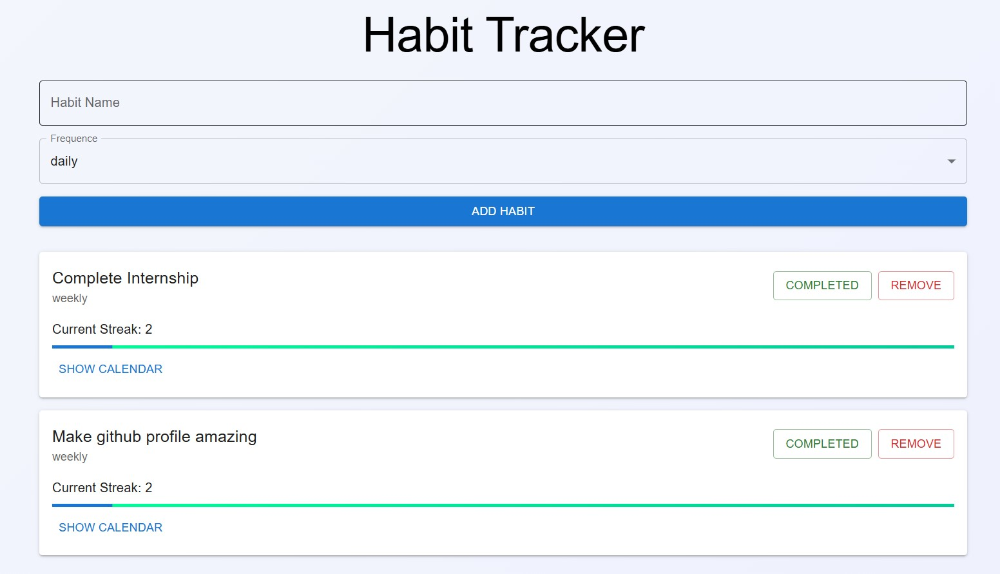

# 🧠 Habit Tracker App

A modern and glowing 🌟 **Habit Tracker App** built with **React**, **TypeScript**, **Zustand**, and **Material UI**. Track your habits, visualize your streaks.

---

## 📸 Preview

---

## 🚀 Features

- ✅ Add, toggle, and remove habits
- 📅 Track completion with a calendar view (using `react-calendar`)
- 🔥 Glowing UI with styled habit cards and progress bars
- ⚡ Powered by Zustand for global state management
- 📦 Responsive, clean design using Material UI

---

## 🛠️ Technologies Used

- ⚛️ React + TypeScript
- 💅 Material UI
- 🧠 Zustand (state management)
- 📆 react-calendar
- 🎨 CSS styles

---

## Contributing 🤝
Contributions are welcome! If you have any suggestions, bug reports, or feature requests, please open an issue or submit a pull request.

